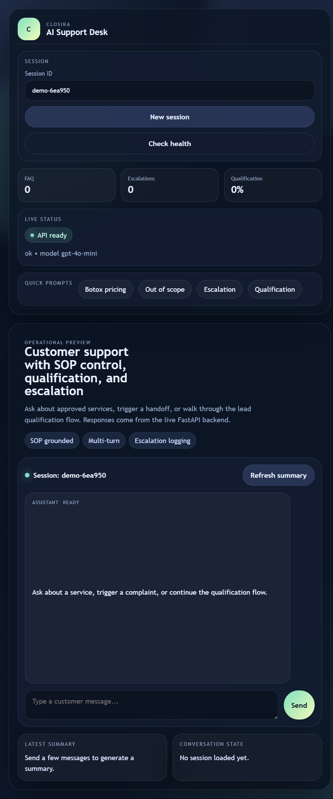

# Closira AI Workflow

Closira AI Workflow is a production-style Python support workflow for Bloom Aesthetics Clinic. It demonstrates SOP-grounded FAQ handling, lead qualification, escalation detection, session memory, structured summaries, and escalation logging using the OpenAI API and FastAPI.

## Overview

The workflow is designed for multi-turn customer support conversations and keeps the assistant constrained to the approved SOP data only. It avoids hallucinations by combining deterministic SOP matching with LLM-assisted classification and fallback escalation when the answer is not supported.

---

# Demo Preview

## AI Support Dashboard Interface

The project includes a modern AI support dashboard demonstrating:

- SOP-grounded customer responses
- Multi-turn conversation handling
- Lead qualification flow
- Escalation detection
- Session tracking
- Real-time FastAPI integration

### Dashboard Screenshot

<p align="center">
  
</p>

---

## Architecture

The request flow is:

1. User message arrives at `/chat`.
2. Session memory is loaded or created.
3. The assistant checks for escalation triggers.
4. The assistant routes supported questions to the SOP-backed FAQ handler.
5. If safe, the assistant asks one qualification question at a time.
6. Escalations are logged to `logs/escalation_logs.json`.
7. `/summary` generates a structured end-of-session summary.

## Folder Structure

```text
closira-ai-workflow/
├── app/
│   ├── main.py
│   ├── prompts.py
│   ├── sop_loader.py
│   ├── faq_handler.py
│   ├── qualification.py
│   ├── escalation.py
│   ├── summarizer.py
│   ├── memory.py
│   ├── logger.py
│   └── utils.py
├── data/
│   └── sop.json
├── test_transcripts/
│   ├── in_scope.md
│   ├── out_of_scope.md
│   ├── escalation.md
│   ├── qualification.md
│   └── summary.md
├── logs/
│   └── escalation_logs.json
├── README.md
├── prompt_design.md
├── requirements.txt
├── .env.example
└── run.py
```

## Setup

1. Create and activate a Python 3.11+ environment.
2. Install dependencies:

```bash
pip install -r requirements.txt
```

3. Copy `.env.example` to `.env` and set `OPENAI_API_KEY`.
4. Start the API:

```bash
python run.py
```

The service runs on `http://127.0.0.1:8000` by default.

## Environment

Required variables:

- `OPENAI_API_KEY`: OpenAI API key
- `OPENAI_MODEL`: optional, defaults to `gpt-4o-mini`
- `HOST`: optional, defaults to `127.0.0.1`
- `PORT`: optional, defaults to `8000`

## API Usage

### Health

```bash
curl http://127.0.0.1:8000/health
```

### Chat

```bash
curl -X POST http://127.0.0.1:8000/chat ^
  -H "Content-Type: application/json" ^
  -d "{\"session_id\":\"demo-1\",\"message\":\"What are your Botox prices?\"}"
```

### Summary

```bash
curl -X POST http://127.0.0.1:8000/summary ^
  -H "Content-Type: application/json" ^
  -d "{\"session_id\":\"demo-1\"}"
```

## Assumptions

- The SOP in `data/sop.json` is the only source of truth for customer-facing facts.
- Unsupported questions should be escalated rather than guessed.
- Qualification questions are gathered as part of the same conversation stream.

## Limitations

- The SOP is intentionally small, so unsupported questions will escalate quickly.
- The assistant does not persist memory to a database; it uses in-memory session tracking.
- This project is built for single-process demo and assignment use, not horizontal scale.

## Future Improvements

- Add durable storage for conversation history and escalations.
- Add a proper queue or task runner for asynchronous escalation handling.
- Expand SOP retrieval into a richer knowledge base with versioning.
- Add tests for escalation edge cases and prompt regression checks.
